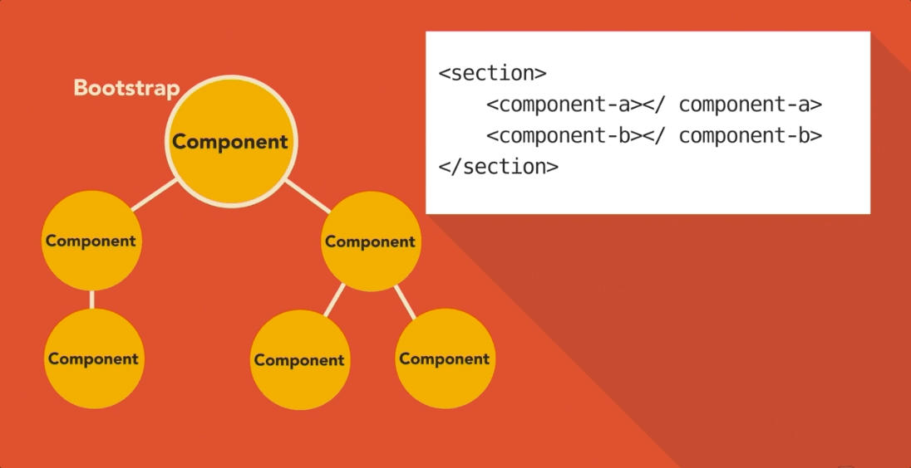
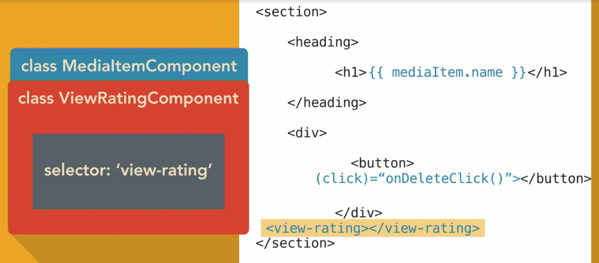

Angular is build upon components. The first step is bootstrapping the initial parent component, and goes down from there like a DOM tree.

An Angular component can be build off:
- HTML component
- CSS component
- JavaScript component
- Optional: Unit testing component.spec.ts file

A component in Angular is used to build a portion of HTML, and provide functionality to that portion. We achieve this with a component class.

Component class holds the component logic. 

The mediaItem store the value.
The onDeleteClick handles the deletion of the mediaItem.

- Each component is configure with a selector. 
- When you build a component you are creating a new custom html element for the DOM.
- We can have use components inside components like show above. 

We Template syntax to display data and run functions.
- Displaying data: `<h1>{{ mediaItem.name}}</h1>`
- Example: `<button (click)="onDeleteClick()">Click me!</button>`

