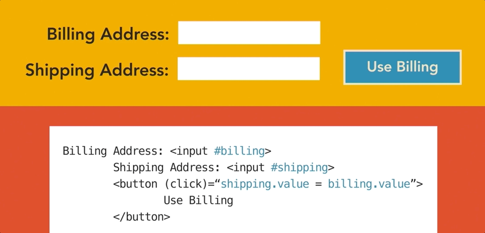
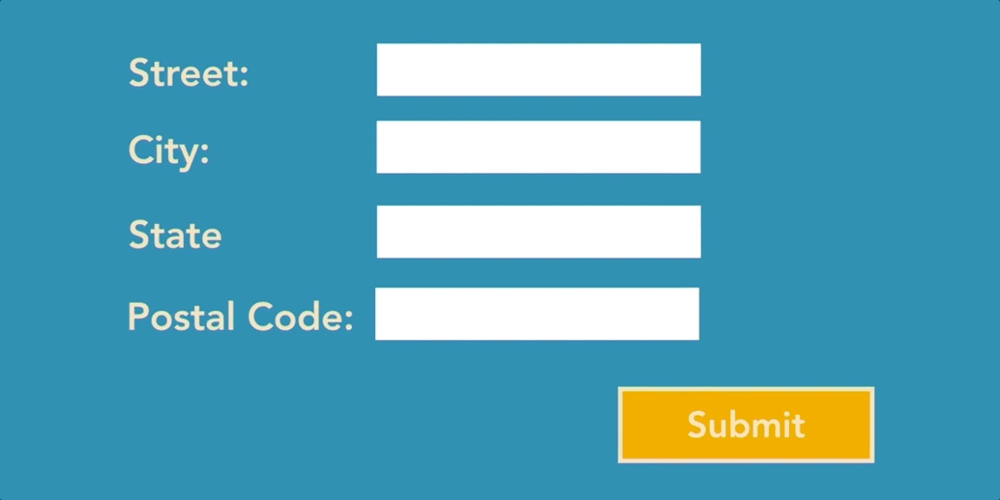

One of Angular strengths is the ease of binding data to views and working with data in those views. 

## Interpolation

`<h1>{{ jsVariable}}</h1>`

The most common way of displaying data in a view template is via interpolation, where you use a set of curly braces around a component property to tell Angular to render the content of that property. 

## Directives

You can also use directives, both built-in Angular framework ones and ones you create to help display data. Directives give you the power client-side to add logic to your views, similar to how you would on the server side. 

## Template syntax

The template syntax in Angular is pretty robust and allows you to accomplish a lot of things when it comes to working with data in your views. You can wire up click events to dom elements that modify data that you have displayed elsewhere, and Angular will handle the update of that data visually.

- Expressions and statements
- Value binding
- Event binding
- Expression operators

## Local template variables

You can also create and use local template variables created in markup using the hash to get a reference to the element and then use that from any sibling or child element in the view.

## Form module

And when it comes to collecting data from the user, Angular has a form module loaded with directives and services for helping you build HTML forms. It provides things like data binding for both setting and getting data, change tracking, validation, and error handling.

