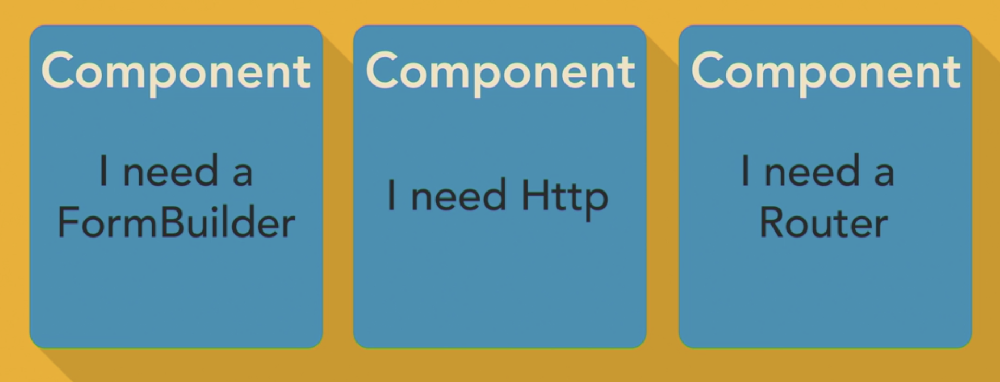
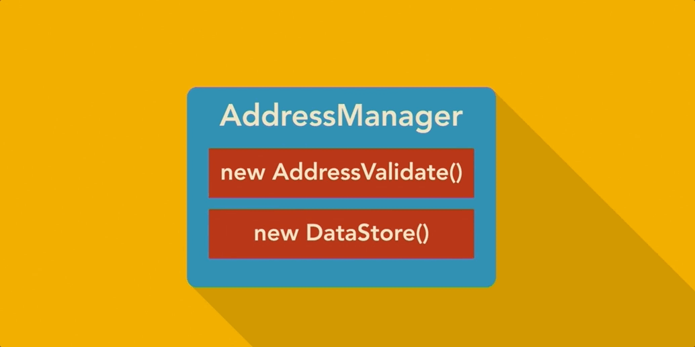
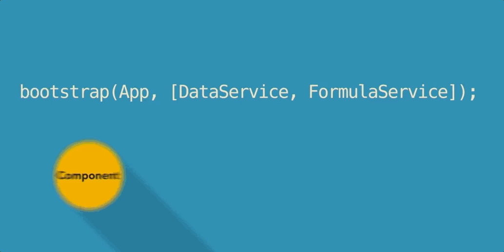

what it is?

Dependency injection (DI) is the concept of inversion of control (IOC)where you architect code in a way that you provide modules with other modules it needs to get some work done instead of having your modules go out and get other modules on their own. 

What it does?

> DI allows you to write decoupled code that is easier to unit test and to work with. 

How to use?

On the component.ts file constructor, you can add the following line:
`constructor(formBuilder: FormBuilder){}`

Where to use?

