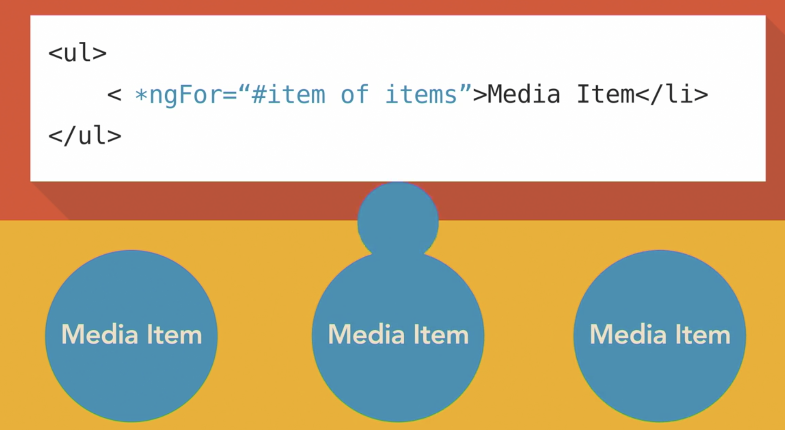
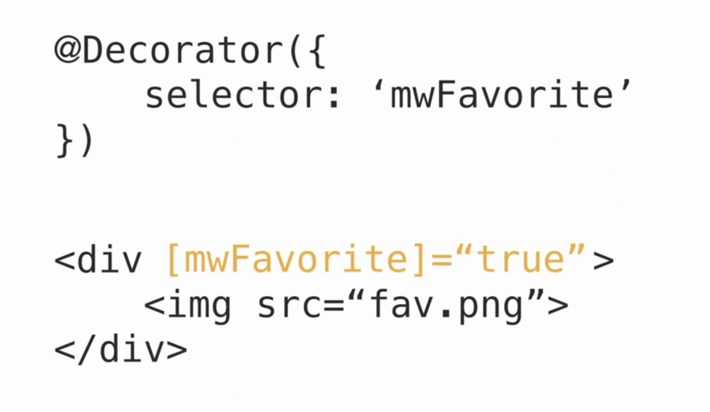

In Angular, a component is actually a directive with a template. Directives provide functionality and can transform the DOM. 

There are two types of directives:
- structural directives
- Attribute directives

## [Structural](https://angular.io/guide/structural-directives)

 Structural directives modify layout by altering elements in the DOM.

## [Attribute](https://angular.io/guide/attribute-directives)

Attribute directives change the behavior or appearance of an existing DOM element. 

## [Build some in directives](https://angular.io/guide/built-in-directives):

- *ngIf
- *ngFor
- routerLink

## [Pipes](https://angular.io/guide/pipes)

 A pipe takes in data, like a stringer or an array, and runs some logic to transform it to a new output. 
 
 Angular comes with some common pipes, like:
 - date and 
 - uppercase and 
 - lowercase. 

**You can also write your own pipes to handle custom scenarios that fit your application needs.** Pipes are a great way to change data in a reusable way without having to embed the transform logic within component classes and without having to modify the data just for display purposes.