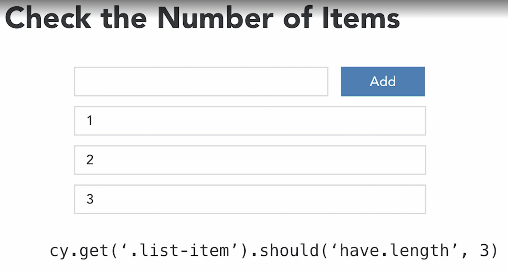
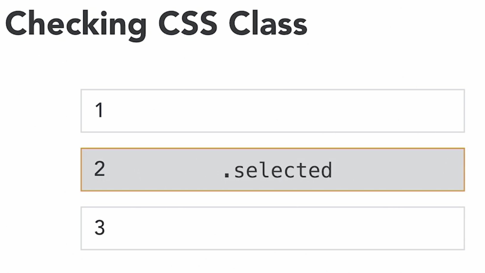

## Checking length

- `.should('have.length', <number>)`

## Checking existence

- `.should('exist')`
- `.should('not.exist')`

## Checking visibility

- `.should('be.visible')`
- `.should('not.be.visible')`

## Checking CSS classes

`should('have.class', 'list-item-selected')`

## Checking specific styles

`.should('have.css', 'background-color', 'blue')`

> Careful in testing CSS due to CSS changing frequently when updating application.

## Checking text content

- `.invoke('text')`
- `.should('contain')`
- `.should('not.contain')`
