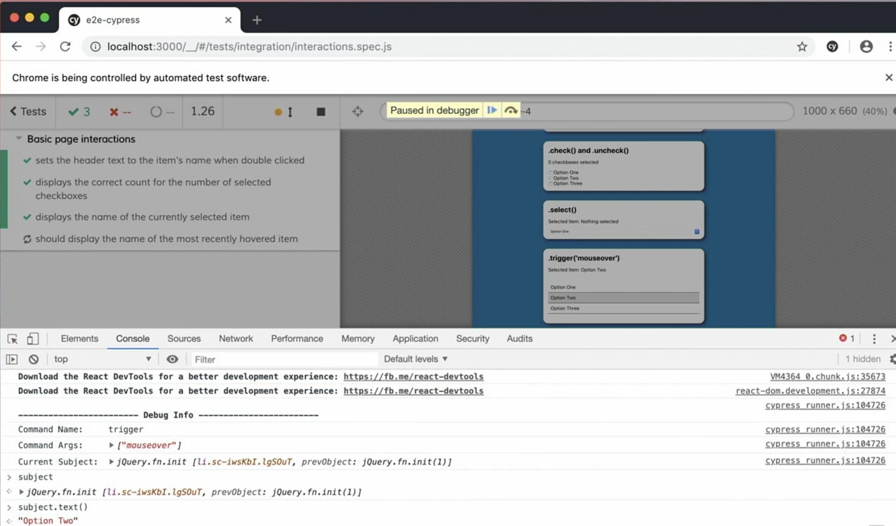

> ## setup
> `gh repo clone royeradames/end-to-end-javascript-testing-with-cypress`
> Start `target-app`
> open `03_05/Start` in the vscode terminal
> `npm i && npx cypress open`

We can use the `.debug()` command to debug a failing test. The browser console will have access to the current selected element. We can also use the cypress panel to see what happen before the test fails.



> Need to have chrome dev tools open for debug() to pause chrome

Alternative

We can use `debugger;` anywhere in the test. But due to async nature, it will run first before any of the test.

Messy way to do `.debug()`
```ts
.then(() => {
  debugger;
})
```

## Practice

> See solution on `03_05/End`

`interactions.spec.js` debug should display the name of the most recently hovered item mouseover

```ts
it("should display the name of the most recently hovered item", () => {
        cy.get('[data-cy=box-4-items-list] > :nth-child(2)')
            .trigger('mouseover')
            .debug()
        
        cy.get('[data-cy=box-4-selected-name]')
            .invoke('text')
            .should('equal', 'Option Two');
    })
```