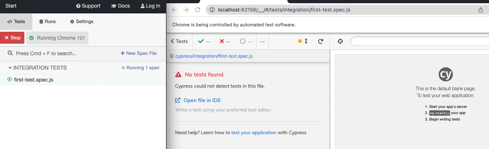

E2e test cannot be run in the browser. We will need to download a GitHub project and run its test locally.

## setup
- `gh repo clone royeradames/end-to-end-javascript-testing-with-cypress`
- Start `target-app`
- open `02_01/Start` in the vscode terminal
- `npm i && npx cypress open`

## Practice

Install a standalone version of Cypress and create our first new test.

- innit package.json `npm init -y`
- install cypress `npm i cypress -D`
- open cypress interface `npx cypress open`
- delete the documentation test that came with cypress. Make `/cypress/integration` empty.
- Create our first test `cypress/integration/first-test.spec.js`
  
  - You will notice that it appears in cypress and if we lick run, it will notify that it's empty.