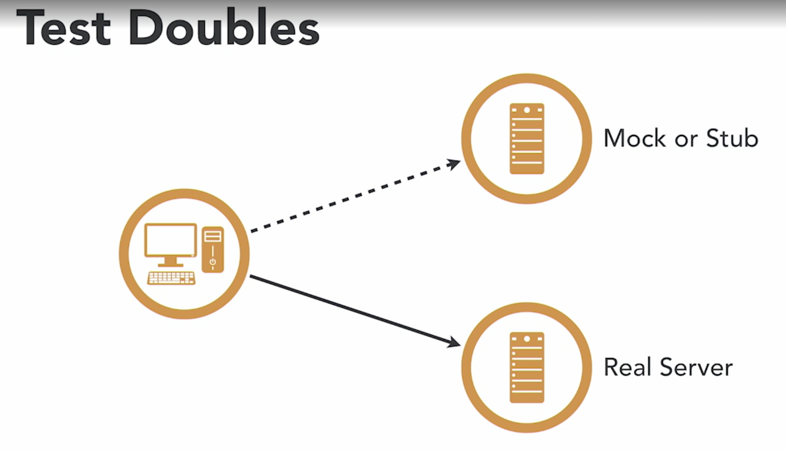

Are methods primarly used for unit testing but they have some use cases in e2e testing. 
- Mocking an error from the server 
  - Instead of causing it
- Bypass the login process
  - So that we can test other pages without having to login

## Cypress wraps Sinon library

- cy.stub()


```ts
// if we know that we are going to use our api
import { api } from './my-api';
// and we know the api method we will be calling
//api.getUser()

// we can watch for the api call (replace the method)
cy.stub(api, 'getUser')
  // and return a fake response 
  .returns({ name: 'Bill})
  // instead we could resolve the object for promises
  // .resolves({ name: 'Bill'})
  // or reject the promise to simulate a network error
  // .rejects('error')
```

- cy.spy()

```ts
import { api } from './my-api';
// api.getUser();

// similar to stub but it doesn't replace them
const mySpy = cy.spy(api, 'getUser');

// it allow use to watch them and make assertions about them
// how many times it was called
// what arguments has been pass down
expect(mySpy).to.be.called;
```

> Easy when cypress and the code base are on the same folder
